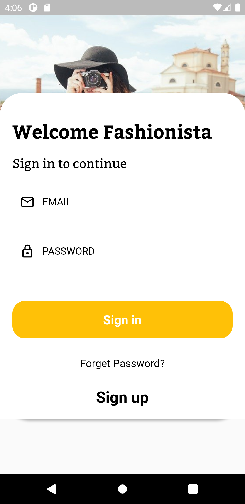

# Fashionista UI Design 

App in which  

1 Login and Regisration Page \n
2 Home Page with Drawer and BottomNavigationBar\n
3 Home Page Show Animated Text \n
4 Use DIO package for Rest API\n
5 Fetch Data from API in API DATA BottomBarNavigation Bar\n
6 Use Provider Package to Select Each Item\n
7 When item is Select then Show Search Button Otherwise Hidden\n

# Login Page

